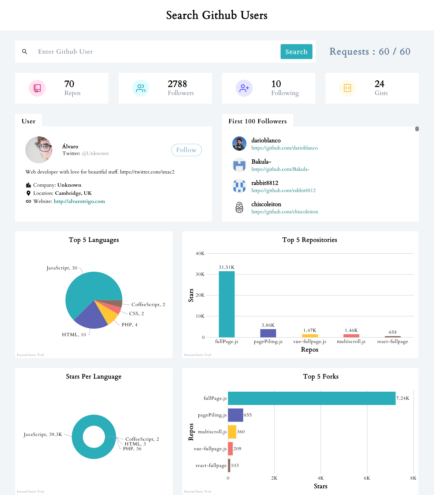

# GitHub User Analytics Dashboard

A modernized **GitHub Analytics System** with interactive data
visualizations, built using **React.js** and **Chart.js**.
This project helps analyze and display **GitHub user information,
repository statistics, languages, and popularity metrics**, while
offering a clean and user-friendly interface.

------------------------------------------------------------------------

<p align="center">
   <a href="https://raw.githubusercontent.com/nithasp/github-users-search/master/screenshots/sc1.png" target="_blank">
    
  </a>
</p>

------------------------------------------------------------------------
## 🚀 Features

-   **Search & Display GitHub Users** -- search by username and retrieve
    key data.
-   **Interactive Charts** -- visualize repositories by languages,
    stars, forks, and popularity.
-   **User Information Panel** -- displays profile details and
    statistics.
-   **Navigation & Error Handling** -- includes a responsive navbar,
    home page, and error page.
-   **Reusable Components** -- modular charts and UI elements for
    scalability.

------------------------------------------------------------------------

## 🛠 Tech Stack

-   **Frontend:** React.js (functional components, Context API)
-   **Charts & Data Visualization:** Chart.js (custom chart components)
-   **Styling:** CSS
-   **Other:** JavaScript (ES6+), Mock Data for testing

------------------------------------------------------------------------

## 📦 Installation

1.  Clone the repository:

    ``` bash
    git clone https://github.com/nithasp/github-users-search
    ```

2.  Navigate to the project directory:

    ``` bash
    cd github-users-search
    ```

3.  Install dependencies:

    ``` bash
    npm install
    ```

4.  Start the development server:

    ``` bash
    npm start
    ```

5.  Open your browser at:

    http://localhost:3000

------------------------------------------------------------------------
